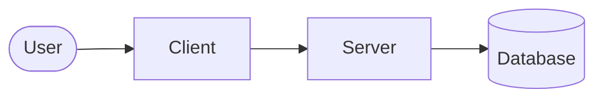

# Architecture

The system as it is now, on one page. Reasons live in `docs/adr/`.

| Part | Responsibility | Where |
|---|---|---|
| Client | <What it owns> | `<top-level directory>` |
| Server | <What it owns> | `<top-level directory>` |

Name top-level directories only. File paths go stale.

## Principles

Cross-cutting rules every part follows. At most ten, each linking the ADR that explains it.

- <e.g. Money is stored as integer minor units (ADR-0002).>
